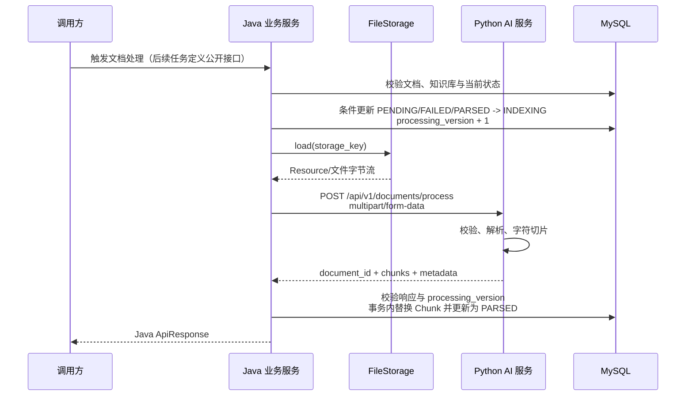

## 文档定位

本文定义 R1-4-1 的目标契约，供 Java 与 Python 实现共同遵守。R1-4-2 已完成 Java 状态、处理版本和 Chunk 持久化基础；R1-4-3 已完成 Python 四种格式的统一解析模块。Python 文档处理路由、切片和 Java/Python HTTP 联调仍未实现，因此本文不是完整的已上线接口说明。

关联工程为仓库内 `voltmind-server/` 与 `ai-service/`。本文依据实际代码中的 `DocumentService`、`FileStorage`、`LocalFileStorage`、`DocumentStatus`、`DocumentController`、FastAPI 路由与异常处理、Flyway V1-V3 编写。

## 服务职责

| 服务 | 负责 | 不负责 |
| --- | --- | --- |
| Java 业务服务 | 文档与知识库权威元数据、原始文件、处理状态、处理触发、Chunk 持久化、对前端返回统一 `ApiResponse` | 文档格式解析、文本切片、Embedding 算法 |
| Python AI 服务 | 接收文件字节、解析内容、按约定切片、返回 Chunk 和解析元数据 | 访问或修改 Java MySQL、读取 Java `storage_key`、保存业务状态、回调前端 |

`document_id` 与 `knowledge_base_id` 只用于跨服务关联。Python 不把它们视为数据库访问凭据，也不校验二者在业务库中的关系；Java 在发起请求前完成权威校验。

## 交互流程



失败处理：Java 在已进入 `INDEXING` 后遇到文件读取失败、Python 业务错误、连接失败、超时、协议错误或 Chunk 持久化失败时，将当前处理版本标为 `FAILED` 并记录安全的错误码和摘要。远程 HTTP 与数据库不能处于同一个事务，写回前必须再次确认文档仍存在且 `processing_version` 未变化。

## Python 内部接口

```http
POST /api/v1/documents/process
Content-Type: multipart/form-data
Accept: application/json
```

该路径是 Java 到 Python 的内部服务接口，不供浏览器直接调用。本阶段不定义前端触发处理的 Java 公共接口，也不增加 Python 对 Java 的回调。

### Multipart 请求字段

Multipart 文本字段使用 UTF-8；数值以十进制文本传输，由 FastAPI 转换为整数。

| 字段 | 类型 | 必填 | 约束 |
| --- | --- | --- | --- |
| `document_id` | int64 | 是 | Java 文档 ID，`1..9223372036854775807` |
| `knowledge_base_id` | int64 | 是 | Java 知识库 ID，`1..9223372036854775807` |
| `file` | binary | 是 | 非空，最大 20 MiB；允许 PDF、DOCX、Markdown、TXT |
| `chunk_size` | int32 | 是 | `100..4000`，单位为 Unicode 字符；建议 Java 默认传 `1000` |
| `chunk_overlap` | int32 | 是 | `0..1000`，单位为 Unicode 字符；建议 Java 默认传 `200`，且必须小于 `chunk_size` |

Java 从 `FileStorage.load(storageKey)` 读取并转发字节流。Multipart 文件名使用 Java 已校验的原始文件名，仅作为解析器识别格式和结果元数据；不得发送本地绝对路径或 `storage_key`。Python 仍需拒绝带路径分隔符、空字节或 `..` 路径段的文件名。

文件类型判断至少同时考虑安全文件名扩展名与内容结构：PDF 校验 PDF 签名，DOCX 校验 ZIP/OOXML 结构；Markdown 与 TXT 按文本解码。客户端提供的 MIME 类型只作提示，不能单独作为可信依据。允许扩展名为 `.pdf`、`.docx`、`.md`、`.markdown`、`.txt`。

请求示例：

```bash
curl --request POST 'http://127.0.0.1:8000/api/v1/documents/process' \
  --header 'Accept: application/json' \
  --form 'document_id=42' \
  --form 'knowledge_base_id=7' \
  --form 'chunk_size=1000' \
  --form 'chunk_overlap=200' \
  --form 'file=@manual.pdf;type=application/pdf'
```

### 长度单位

R1-4-1 的 `chunk_size` 和 `chunk_overlap` 均表示 **Unicode code point 数量**，不是 UTF-8 字节数，也不是模型 Token 数。Python 应按解析后的 Unicode 字符串计数，并在响应 `metadata.length_unit` 中返回 `CHARACTER`。

字符切片与 Token 切片不能静默互换。后续需要按模型 Token 切片时，应在新接口版本或向后兼容字段中显式增加 `length_unit=TOKEN` 与 `tokenizer`，旧请求仍保持字符语义。

## 成功响应

HTTP 200：

```json
{
  "document_id": 42,
  "chunk_count": 2,
  "chunks": [
    {
      "chunk_index": 0,
      "content": "VoltMind 的第一段正文……",
      "page_number": 1,
      "section": "系统简介"
    },
    {
      "chunk_index": 1,
      "content": "VoltMind 的第二段正文……",
      "page_number": 2,
      "section": null
    }
  ],
  "metadata": {
    "file_name": "manual.pdf",
    "file_type": "PDF",
    "page_count": 12,
    "parser": "pymupdf",
    "parser_version": "1.0.0",
    "length_unit": "CHARACTER",
    "chunk_size": 1000,
    "chunk_overlap": 200,
    "content_char_count": 1764
  }
}
```

### 顶层字段

| 字段 | 类型 | 必填 | 规则 |
| --- | --- | --- | --- |
| `document_id` | int64 | 是 | 必须原样回显请求值；Java 不接受 ID 不一致的响应 |
| `chunk_count` | int32 | 是 | 大于 0，且必须等于 `chunks.length` |
| `chunks` | array | 是 | 非空，按 `chunk_index` 升序返回 |
| `metadata` | object | 是 | 解析器与切片参数，核心字段固定 |

### Chunk 数据结构

| 字段 | 类型 | 必填 | 规则 |
| --- | --- | --- | --- |
| `chunk_index` | int32 | 是 | 从 0 开始，在单文档内连续、唯一 |
| `content` | string | 是 | 去除首尾空白后非空；保留正文内部换行 |
| `page_number` | int32 或 null | 是 | 可定位页码时从 1 开始；TXT、Markdown 或无法可靠定位时为 `null` |
| `section` | string 或 null | 是 | 可识别标题时填写，最长 512 字符；无法识别时为 `null` |

Python 负责保证切片顺序与重叠规则，Java 负责再次校验 ID、数量、索引连续性和必填字段，再持久化。Java 计算并保存标准化 `content` 的 SHA-256，供重处理审计和未来向量写入幂等使用。

### Metadata 数据结构

| 字段 | 类型 | 必填 | 规则 |
| --- | --- | --- | --- |
| `file_name` | string | 是 | 安全文件名，不含服务器路径 |
| `file_type` | enum | 是 | `PDF`、`DOCX`、`MARKDOWN`、`TXT` |
| `page_count` | int32 或 null | 是 | PDF/DOCX 能可靠计算时大于 0，否则为 `null` |
| `parser` | string | 是 | 解析器稳定标识，最长 64 字符 |
| `parser_version` | string | 是 | 解析器或实现版本，最长 64 字符 |
| `length_unit` | enum | 是 | 本版本固定为 `CHARACTER` |
| `chunk_size` | int32 | 是 | 原样回显已生效的请求值 |
| `chunk_overlap` | int32 | 是 | 原样回显已生效的请求值 |
| `content_char_count` | int64 | 是 | 切片前规范化正文的 Unicode 字符数，大于 0 |

核心字段不能以任意字典替代。未来解析器特有信息可以增加可选字段，但调用方不得依赖未经契约确认的扩展字段。

## 错误契约

Python 当前业务异常由 `ServiceError` 返回 `{"detail":"错误说明"}`，FastAPI 参数校验错误返回默认的 422 `detail` 数组。为使 Java 不依赖错误文案，文档处理业务错误提议在兼容保留 `detail` 的同时增加 `code`：

```json
{
  "detail": "Document content is empty",
  "code": "EMPTY_DOCUMENT_CONTENT"
}
```

现有聊天和模型接口不要求同步改造；它们可以继续只返回 `detail`。FastAPI 框架参数校验的 422 仍可能是数组，Java 按 HTTP 422 统一映射为 `INVALID_PROCESSING_REQUEST`，不得假设 `detail` 始终为字符串。

| 场景 | 责任边界 | Python HTTP / code | Java 对外 HTTP / code | 状态处理 | 建议重试 |
| --- | --- | --- | --- | --- | --- |
| 文档不存在 | Java 调用前校验 | 不调用 Python | 404 / `DOCUMENT_NOT_FOUND` | 不变 | 否 |
| 知识库不存在或归属不符 | Java 调用前校验 | 不调用 Python | 404 / `KNOWLEDGE_BASE_NOT_FOUND` | 不变 | 否 |
| 文档正在处理 | Java 条件更新 | 不调用 Python | 409 / `DOCUMENT_ALREADY_PROCESSING` | 保持 `INDEXING` | 否 |
| 当前状态不允许处理 | Java 状态机 | 不调用 Python | 409 / `INVALID_DOCUMENT_STATUS` | 不变 | 否 |
| 原始文件读取失败 | Java `FileStorage` | 不调用 Python | 500 / `FILE_READ_FAILED` | `FAILED` | 修复文件后 |
| Multipart 字段非法 | Python/FastAPI | 422 / 默认校验结构 | 400 / `INVALID_PROCESSING_REQUEST` | `FAILED` | 修正请求后 |
| 文件超过上限 | Python 防御性校验 | 413 / `FILE_TOO_LARGE` | 413 / `FILE_TOO_LARGE` | `FAILED` | 否 |
| 不支持的文件类型 | Python 格式校验 | 415 / `UNSUPPORTED_FILE_TYPE` | 415 / `UNSUPPORTED_FILE_TYPE` | `FAILED` | 否 |
| 文件内容为空 | Python 解析后校验 | 422 / `EMPTY_DOCUMENT_CONTENT` | 422 / `EMPTY_DOCUMENT_CONTENT` | `FAILED` | 文件变化后 |
| 文件无法解析 | Python 解析器 | 422 / `DOCUMENT_PARSE_FAILED` | 422 / `DOCUMENT_PARSE_FAILED` | `FAILED` | 文件或解析器变化后 |
| Python 内部异常 | Python | 500 / `PROCESSING_INTERNAL_ERROR` | 502 / `DOCUMENT_PROCESSING_FAILED` | `FAILED` | 有条件 |
| Python 服务不可用 | Java HTTP 客户端 | 无响应 | 503 / `DOCUMENT_PROCESSING_SERVICE_UNAVAILABLE` | `FAILED` | 是，退避 |
| 请求超时 | Java HTTP 客户端 | 无有效响应 | 504 / `DOCUMENT_PROCESSING_TIMEOUT` | `FAILED` | 人工或退避 |
| Python 响应不符合契约 | Java 响应校验 | 2xx/异常响应 | 502 / `DOCUMENT_PROCESSING_BAD_RESPONSE` | `FAILED` | 修复服务后 |
| Chunk 数据库写入失败 | Java 持久化 | 已返回成功 | 500 / `CHUNK_PERSISTENCE_FAILED` | `FAILED` | 是，整文档重试 |

错误消息不得包含绝对文件路径、数据库信息、堆栈、文件正文或密钥。Python 可在服务日志中用内部关联信息记录完整异常；Java 面向前端只返回稳定错误码与安全摘要。

## 调用、并发与幂等

- Java 以数据库条件更新抢占处理权，仅允许一个处理版本进入 `INDEXING`；不能只在内存加锁。
- 每次开始处理递增 `processing_version`。HTTP 调用返回后，Java 仅在版本仍匹配且文档仍存在时写入 Chunk，避免删除、重传或新一轮处理后旧响应覆盖新结果。
- Python 接口是无状态计算，同一文件和参数允许重复调用；结果应在相同解析器版本下保持顺序稳定。
- Java 使用“按文档删除旧 Chunk，再批量插入新 Chunk”的单数据库事务完成替换，并在同一事务更新 `chunk_count` 与状态。
- HTTP 超时不表示 Python 已停止计算。本阶段不自动无限重试，调用方重新触发时创建新 `processing_version`。
- Java 可配置连接与读取超时，建议初值分别为 3 秒和 60 秒；20 MiB 上限下仍需通过真实文档压测调整，不能把建议值视为已验证容量。

## 状态流转

R1-4-1 建议新增 `PARSED`。当前 `INDEXING` 暂时表示“解析和切片处理中”，解析成功后必须进入 `PARSED`，不能直接标记表示向量已可检索的 `INDEXED`。

```text
PENDING ───────> INDEXING ───────> PARSED
                    │                │
                    └────> FAILED    └────> INDEXING（重新解析）
                              │
                              └────> INDEXING（重试）

未来：PARSED ──> 向量化处理中 ──> INDEXED
```

| 状态 | 本阶段含义 |
| --- | --- |
| `PENDING` | 原始文件和元数据已保存，尚未开始解析 |
| `INDEXING` | 兼容现有枚举的临时处理中状态；R1-4 只执行解析与切片 |
| `PARSED` | 解析和切片完成，Chunk 已持久化；尚未 Embedding，不能用于向量检索 |
| `INDEXED` | Embedding 与向量入库完成；本阶段不得写入此状态 |
| `FAILED` | 最近一次处理失败，错误码、摘要和版本已记录 |

`INDEXING` 同时暗示向量化是已知的语义债。开始 Embedding 实现前应评估新增 `PARSING`、`EMBEDDING` 或独立阶段字段，避免一个状态同时表示不同任务。

## Flyway V4 实际迁移

现有 V1-V3 保持不变。R1-4-2 已新增并在 MySQL 8.4.9 实际执行 `V4__add_document_processing_state_and_chunks.sql`。

V4 实际变更：

1. 删除 V1 的 `chk_kb_document_status`，以包含 `PARSED` 的集合重新创建：`PENDING, INDEXING, PARSED, INDEXED, FAILED`。
2. 在 `kb_document` 增加 `processing_version BIGINT NOT NULL DEFAULT 0`、`processing_error_code VARCHAR(64) NULL`、`processing_error_message VARCHAR(1000) NULL`，并增加版本非负约束和中文字段注释。
3. 新建 `kb_document_chunk` 保存 Chunk 真源，表和每个字段均带中文注释。
4. 为 `kb_document_chunk(document_id, processing_version, chunk_index)` 建复合唯一约束，为 `document_id` 建外键并 `ON DELETE CASCADE`；增加版本、索引和页码检查约束。
5. 集成测试已验证 V4、重复启动、默认版本、`PARSED`、唯一约束、外键级联、旧版本拒绝和批量事务回滚。

`processed_at`、切片参数和解析元数据尚未进入 V4；需要持久化这些可复现信息时应使用新的增量迁移，不得修改已执行的 V4。

建议的 Chunk 表字段：

| 字段 | 数据库类型 | 规则/用途 |
| --- | --- | --- |
| `id` | BIGINT | 主键，自增 |
| `document_id` | BIGINT | 非空，关联 `kb_document.id` |
| `processing_version` | BIGINT | 非空，生成该 Chunk 的处理版本 |
| `chunk_index` | INT | 非空，文档内从 0 连续递增 |
| `content` | MEDIUMTEXT | 非空，Chunk 正文真源 |
| `content_hash` | CHAR(64) | 非空，正文 SHA-256 小写十六进制 |
| `page_number` | INT | 可空，页码从 1 开始 |
| `section` | VARCHAR(512) | 可空，章节标题 |
| `created_at` | DATETIME(3) | 非空，默认当前时间 |

Chunk 表不冗余 `knowledge_base_id`，避免同一行中知识库 ID 与文档归属不一致；按知识库查询时通过 `kb_document` 连接。删除知识库仍由 Java 先清理原始文件，再删除业务记录；Chunk 可随文档外键级联，因为它们完全处于同一数据库事务中。

## Embedding 与 Milvus 扩展

MySQL 中的 Chunk 是正文权威来源，Milvus 后续只保存向量、检索字段和关联标识，不作为正文唯一真源。向量记录至少关联 `document_id`、Chunk 数据库 ID、`chunk_index`、`knowledge_base_id`、`content_hash`、Embedding 模型与版本。

后续链路从 `PARSED` 文档读取 MySQL Chunk，批量请求 Python Embedding，再由负责业务编排的一方写入 Milvus。全部 Chunk 向量写入并校验成功后才将文档标记为 `INDEXED`。重解析会产生新的 `processing_version` 和内容哈希，旧版本向量应按版本删除或失效，避免新旧 Chunk 混用。

## 已知风险

- 同步返回全部 Chunk 会放大响应体、内存占用和超时风险，大文档或 OCR 场景可能需要改为异步任务与结果分页。
- Java 向 Python 传文件会产生一次跨服务复制；直接共享 Java 本地路径会破坏隔离和部署可移植性，因此不采用。
- 数据库事务不能覆盖远程 HTTP；Python 成功但 Java 落库失败时只能以整文档幂等重试补偿。
- HTTP 超时后 Python 可能仍在运行，必须依靠 `processing_version` 拒绝迟到结果。
- 文档删除、重新上传与处理中请求可能并发，写回前必须复查文档和版本。
- `MEDIUMTEXT` 适合当前阶段的可审计真源；规模增长后可能需要将正文迁移到对象存储并保留数据库索引。
- 扫描 PDF 的 OCR、密码保护文档、损坏 OOXML、文本编码探测尚未定义，实施时应明确支持矩阵与失败码。
- Python 内部接口当前没有服务间鉴权；本地开发可绑定回环地址，部署前必须增加内网隔离和服务身份认证。
- TXT/Markdown 无可靠页码，DOCX 的分页也可能随渲染器变化，`page_number` 与 `section` 必须允许 `null`。
- `INDEXING` 的名称混合解析和向量化语义，是需要在 Embedding 阶段前偿还的状态模型风险。

## 相关资料

- 当前 Java 对外契约：《[Java 业务服务接口契约](./05-Java业务服务接口契约.md)》
- 当前 Python 对外契约：《[AI 服务接口契约](./04-AI服务接口契约.md)》
- 状态和存储选择：《[文档处理状态与 Chunk 持久化决策](./07-文档处理状态与Chunk持久化决策.md)》
- 架构总览：《[技术架构](./02-技术架构.md)》

